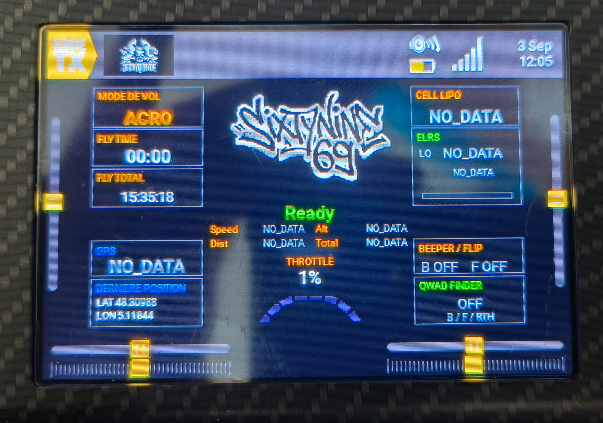

# JWAIO — Jeckyll Widget All in One

JWAIO est un widget Lua FPV plein écran, également utilisable en mode application,
conçu exclusivement pour la **RadioMaster TX15 Max** sous **EdgeTX 2.12.x**.

Il regroupe les contrôles avant décollage, les alertes sonores essentielles, le
suivi GPS et le **Qwad Finder**, basé sur la puissance du signal reçu.

Version actuelle : **0.2.1 — version de test**.

## Télécharger JWAIO

[⬇️ **Télécharger JWAIO v0.2.1 — version de test**](https://github.com/DrJeckyllMrHyde/JWAIO-EdgeTX/releases/download/v0.2.1/JWAIO-v0.2.1.zip)

Le ZIP d'installation est prêt à être extrait directement à la racine de la carte
SD de la radio.

[Voir les notes de version et télécharger la sauvegarde source](https://github.com/DrJeckyllMrHyde/JWAIO-EdgeTX/releases/tag/v0.2.1)

> JWAIO assiste le pilote, mais ne remplace ni les vérifications de sécurité,
> ni l'OSD vidéo, ni un dispositif de localisation autonome.

## Installation en 5 minutes

Cette section suffit pour installer et lancer le widget. Les explications
complémentaires se trouvent plus bas dans le README et dans la documentation.

### 1. Télécharger

Cliquez sur le bouton **Télécharger JWAIO** situé en haut de cette page.

### 2. Sauvegarder la carte SD

Avant toute modification, copiez le contenu de la carte SD de la radio sur votre
ordinateur. Vous pouvez également sauvegarder la configuration de la radio avec
[EdgeTX Buddy](https://buddy.edgetx.org/).

### 3. Installer les fichiers

1. Éteignez la radio.
2. Retirez sa carte SD et branchez-la à l'ordinateur.
3. Ouvrez le fichier ZIP téléchargé.
4. Copiez tout son contenu à la racine de la carte SD.
5. Acceptez la fusion des dossiers si votre ordinateur la propose.

**Attention :** ne copiez pas le dossier ZIP lui-même dans un nouveau
sous-dossier. À la fin, les dossiers suivants doivent être présents sur la carte :

~~~text
/WIDGETS/JWAIO/
/SOUNDS/fr/JWAIO/
/LOGS/JWAIO/
~~~

### 4. Découvrir les capteurs

1. Replacez la carte SD et allumez la radio.
2. Sélectionnez le modèle concerné.
3. Alimentez le drone, hélices retirées.
4. Ouvrez la page de télémétrie du modèle.
5. Lancez la découverte des nouveaux capteurs.
6. Attendez que les capteurs apparaissent, puis arrêtez la découverte.

### 5. Ajouter et régler JWAIO

1. Ajoutez **JWAIO** sur une page plein écran ou comme application.
2. Ouvrez les réglages du widget.
3. Choisissez le type de batterie et le nombre de cellules.
4. Affectez les interrupteurs Arm, PreArm, Beeper, Flip et RTH.
5. Vérifiez la voie du Throttle et le type de liaison radio.
6. Testez les informations et les sons avec les hélices retirées.

JWAIO est maintenant prêt pour un premier essai au sol.

## Vérification rapide avant le vol

- La tension par cellule est affichée et correspond à la batterie branchée.
- Le nombre de satellites évolue lorsque le GPS reçoit un signal.
- Les états Ready, Pre-Arm et Arm réagissent aux bons interrupteurs.
- Le Throttle reste proche de 0 % au repos.
- La qualité de liaison et le RSSI sont affichés.
- Aucun message NO_DATA inattendu ne reste visible.
- Les alertes sonores ne sont pas déjà configurées une seconde fois dans EdgeTX.

Si un capteur reste sur NO_DATA, recommencez sa découverte avant de modifier le
script.

## Fonctions principales

- Modes de vol ANGLE, ACRO et RTH.
- États Ready, Pre-Arm et Arm.
- Alertes sonores lors de l'activation des modes et des fonctions principales.
- Throttle affiché en pourcentage avec cinq états graphiques PNG.
- Alerte de protection si le Throttle reste très élevé pendant plus de trois secondes.
- Fly Time lu depuis TIMER 1 et Fly Total lu depuis TIMER 2.
- Batteries LiPo, LiIon et LiHv avec tension par cellule.
- Alertes de batterie pleine, faible et critique adaptées au type de batterie.
- Position GPS, nombre de satellites, vitesse et altitude.
- Alerte lorsque le GPS obtient suffisamment de satellites.
- Liaison ELRS ou TBS Crossfire avec LQ, RSSI et jauge de qualité.
- Alerte lorsque la qualité de liaison descend sous 70 %.
- Distance au point de départ, distance maximale et trajet total estimé.
- Sauvegarde de la dernière position GPS et des distances du dernier vol valide.
- Création d'un journal CSV à une fréquence de 1 Hz.
- Qwad Finder activé uniquement lorsque Beeper, Flip ou RTH est actif.
- Bips du Qwad Finder de plus en plus rapprochés à l'approche du drone.

## Capteurs attendus

Plusieurs capteurs sont lus directement par leur nom afin de respecter la limite
des réglages du menu EdgeTX.

| Donnée | Nom EdgeTX attendu |
|---|---|
| Batterie | RxBt |
| GPS | GPS |
| Altitude | Alt |
| Vitesse au sol | GSpd |
| Satellites | Sats |
| Qualité de liaison | RQly |
| RSSI du Qwad Finder | 1RSS |

Ces noms peuvent être modifiés dans
sdcard/WIDGETS/JWAIO/config.lua si votre installation utilise d'autres noms.

## Réglages du widget

| Réglage | Utilisation |
|---|---|
| BatType | Choix LiPo, LiIon ou LiHv |
| Cells | Nombre de cellules de la batterie |
| LinkType | Choix ELRS ou TBS_CF |
| LQ | Source de qualité de liaison |
| Arm | Interrupteur d'armement des moteurs |
| PreArm | Interrupteur de pré-armement |
| Beeper | Interrupteur du beeper |
| Flip | Interrupteur du Flip Over After Crash |
| RTH | Interrupteur du Return to Home |
| Throttle | Voie des gaz, CH3 par défaut |

## Timers EdgeTX

- **TIMER 1** alimente l'affichage Fly Time.
- **TIMER 2** alimente l'affichage Fly Total.

Configurez leur déclenchement dans le modèle EdgeTX selon votre utilisation.
Fly Time doit repartir de zéro lorsque les moteurs sont désarmés.

## Journaux et Open Drone Log

Les journaux sont enregistrés au format CSV. Ils peuvent être ouverts dans Excel
ou LibreOffice Calc.

Le convertisseur fourni crée une copie compatible avec les colonnes attendues par
Open Drone Log sans modifier le fichier original :

~~~text
python tools/jwaio_to_opendronelog.py "F260903_112000.csv"
~~~

Consultez le guide
[Utiliser JWAIO avec Open Drone Log](docs/OPEN_DRONE_LOG.md).

[Open Drone Log](https://opendronelog.com/) est un projet gratuit et open source,
indépendant de JWAIO.

## Personnaliser le logo affiché sur la radio

Remplacez le fichier sdcard/WIDGETS/JWAIO/img/logo.png par une image :

- nommée exactement logo.png ;
- au format PNG RGBA avec transparence ;
- mesurant exactement **216 × 132 pixels**.

Effectuez le remplacement lorsque la radio est éteinte, puis redémarrez EdgeTX ou
rechargez complètement le widget. Chaque utilisateur reste responsable des droits
du visuel qu'il emploie.

## Documentation

- [Mode d'emploi rapide](MODE_EMPLOI.txt)
- [Mode d'emploi détaillé](docs/MODE_EMPLOI.md)
- [Guide d'installation](docs/INSTALLATION.md)
- [Présentation synthétique au format PDF](output/pdf/JWAIO-Presentation-v0.2.1.pdf)
- [Notes de version](CHANGELOG.md)

## Développement et vérification

Les outils de construction se trouvent dans le dossier tools. Le projet vérifie
notamment la structure de la carte SD, les dix réglages du menu, les sons WAV, les
images PNG et la syntaxe des modules Lua.

Le test du convertisseur Open Drone Log s'exécute avec :

~~~text
python tests/test_opendronelog_converter.py
~~~

## Licences et attribution

- Code source : [Apache License 2.0](LICENSE).
- Documentation, logo du projet et sons originaux :
  [Creative Commons Attribution 4.0](LICENSE-ASSETS.md).
- Crédits : [AUTHORS.md](AUTHORS.md) et [NOTICE](NOTICE).
- Composants tiers :
  [sdcard/THIRD_PARTY_NOTICES.txt](sdcard/THIRD_PARTY_NOTICES.txt).

Copyright © 2026 **DrJeckyllMrHyde**.

- [Facebook](https://www.facebook.com/)
- [YouTube — JeckyllHydeFpv](https://www.youtube.com/@JeckyllHydeFpv)
