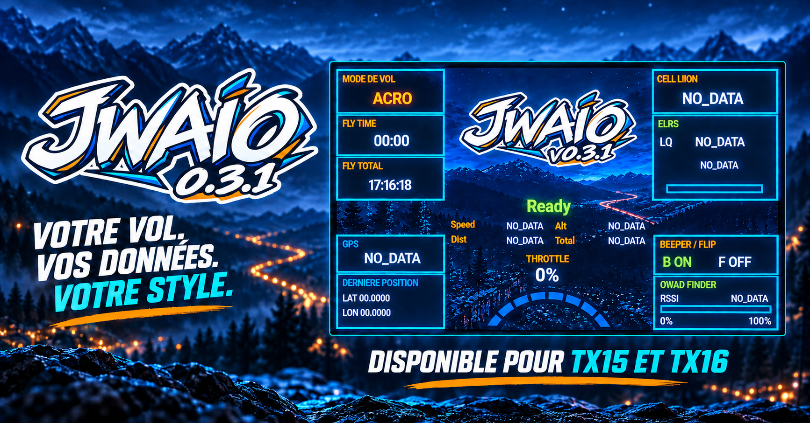
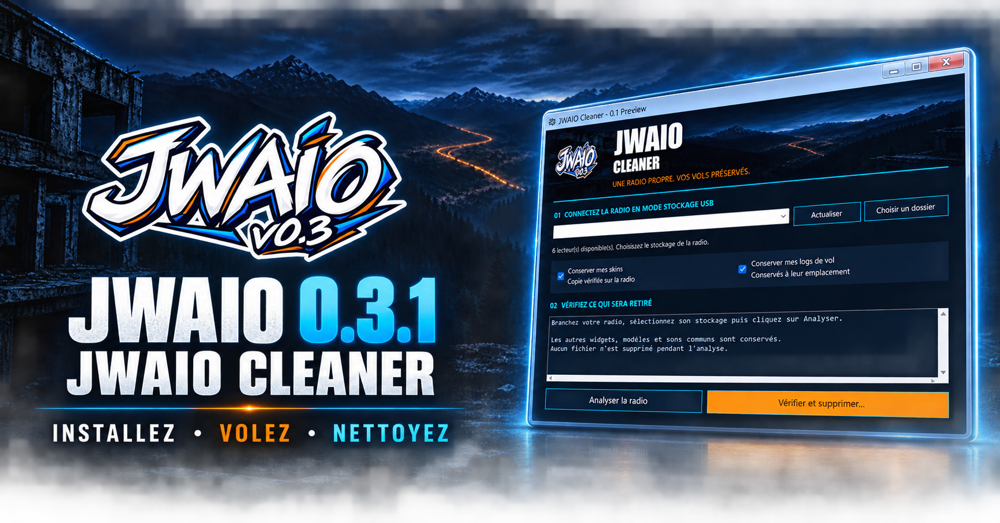
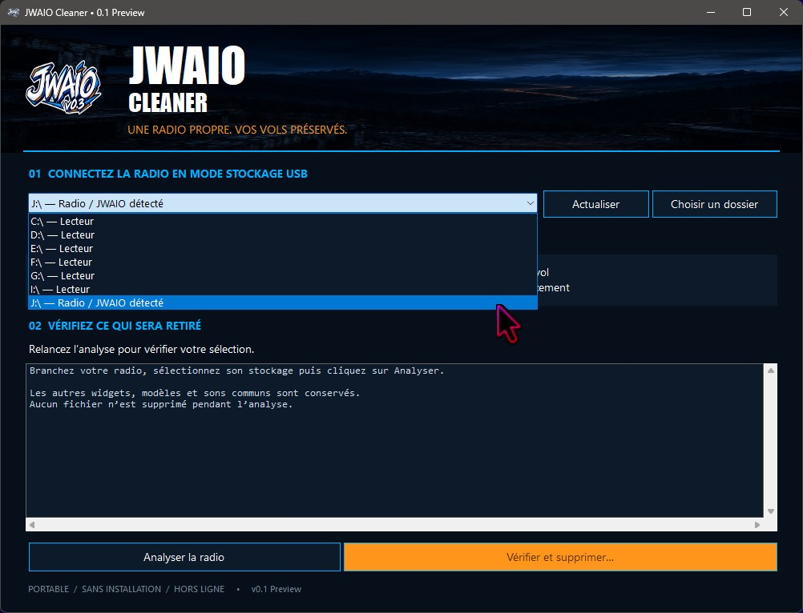
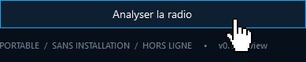
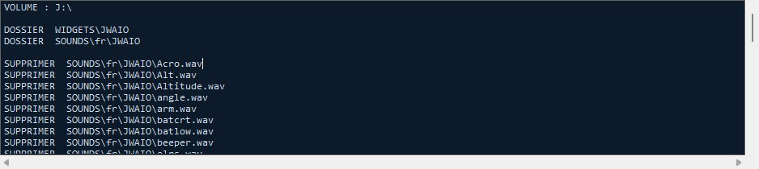
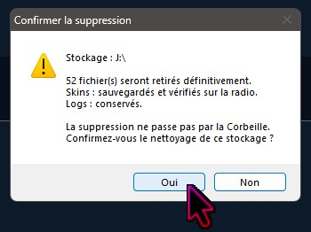
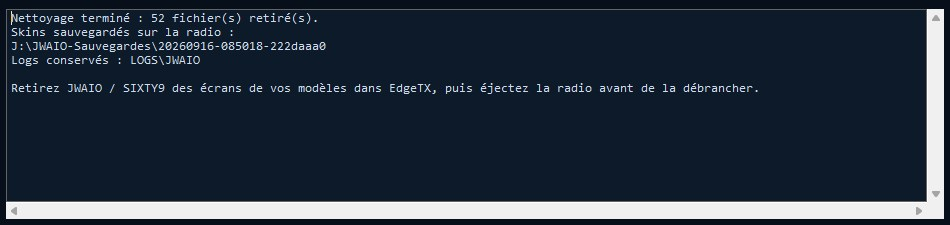

# JWAIO v0.3.1 Alpha

**Alpha testée positivement sur TX15 et TX16S Mk1/Mk2.**

**Jeckyll Widget All in One** rassemble les informations FPV, les alertes vocales et une aide à la recherche du quad sur l'écran de votre radio RadioMaster. Trois archives distinctes sont proposées pour **TX15/TX15 Max**, **TX16S Mk1/Mk2** et **TX16S Mk3**, avec EdgeTX 2.12.x.

> **JWAIO Cleaner — Windows 10/11 :** outil portable de désinstallation avec conservation optionnelle des skins et logs. [Télécharger la Preview](https://github.com/DrJeckyllMrHyde/JWAIO-EdgeTX/releases/tag/cleaner-v0.1.0-preview) · [Mode d'emploi débutant](docs/CLEANER.md) · [Rapports antivirus](docs/CLEANER-ANTIVIRUS.md). **Analyses documentées du 15/09/2026 : VirusTotal 5/69, Jotti 0/13 ; faux positifs possibles mais non confirmés.**

## Choisir et télécharger sa version

| Radio | Archive v0.3.1 |
|-------|----------------|
| TX15 / TX15 Max | [Télécharger](https://github.com/DrJeckyllMrHyde/JWAIO-EdgeTX/raw/main/releases/v0.3.1/JWAIO-v0.3.1-Alpha-TX15.zip) |
| TX16S Mk1 / Mk2 | [Télécharger](https://github.com/DrJeckyllMrHyde/JWAIO-EdgeTX/raw/main/releases/v0.3.1/JWAIO-v0.3.1-Alpha-TX16S-Mk1-Mk2.zip) |
| TX16S Mk3 | [Télécharger](https://github.com/DrJeckyllMrHyde/JWAIO-EdgeTX/raw/main/releases/v0.3.1/JWAIO-v0.3.1-Alpha-TX16S-Mk3.zip) |

**TX15 et TX16S Mk1/Mk2 :** les scripts ont été testés et sont fonctionnels pour tous les usages. Seuls des correctifs mineurs et des optimisations restent possibles.

**TX16S Mk3 :** Je ne possède pas cette radio. Le widget a été adapté à partir des spécifications matérielles publiées par RadioMaster et **n'a pas été testé physiquement**. Il nécessite **EdgeTX 2.12.0 ou supérieur** ; le fonctionnement du widget sur le firmware exact installé reste à confirmer. **Des testeurs TX16S Mk3 sont recherchés** : [procédure et informations à transmettre](docs/TESTS_TX16_MK3.md).

Les archives Alpha et les sources du dépôt correspondent à la même base v0.3.1. Les identifiants de version et les notices ont été harmonisés ; la logique du widget est conservée. Le statut Alpha permet encore des correctifs et des optimisations.

[Guide débutant](docs/INSTALLATION.md) · [Mode d'emploi](docs/MODE_EMPLOI.md) · [Version texte](MODE_EMPLOI.txt) · [Notes de version](CHANGELOG.md)

## Installer en quelques étapes

1. Téléchargez **uniquement l'archive de votre radio** dans le tableau ci-dessus. Le ZIP général « Code / Download ZIP » du dépôt n'est pas un paquet d'installation.
2. Sauvegardez le stockage de la radio et votre modèle EdgeTX, y compris vos réglages JWAIO, skins et journaux.
3. Décompressez l'archive sur l'ordinateur. Les trois paquets présentent directement les dossiers à copier.
4. Branchez le port USB de données de la radio, choisissez **USB Storage / Stockage USB**, puis ouvrez le volume utilisé par EdgeTX pour ses scripts.
5. Copiez les dossiers **WIDGETS, SOUNDS et LOGS** à la racine de ce volume. Fusionnez les dossiers et remplacez uniquement les fichiers JWAIO concernés.
6. Éjectez proprement le volume et redémarrez la radio. Découvrez les capteurs du modèle, ajoutez JWAIO dans une zone unique et vérifiez les dix options.
7. Effectuez les premiers contrôles au sol, hélices retirées. Le [guide illustré par des chemins concrets](docs/INSTALLATION.md) détaille chaque étape et le dépannage.
8. Sur TX16S, passez manuellement le widget en plein écran depuis l’écran d’accueil pour bénéficier de tout l’affichage.

Le chemin final doit être `/WIDGETS/JWAIO/main.lua`, sans dossier d'archive intermédiaire. Une seule variante et une seule instance JWAIO par modèle : toutes utilisent les mêmes chemins.

## Supprimer le Widget

**[Télécharger JWAIO Cleaner pour Windows 10/11](https://github.com/DrJeckyllMrHyde/JWAIO-EdgeTX/releases/tag/cleaner-v0.1.0-preview)** · [Mode d'emploi débutant](docs/CLEANER.md)

JWAIO Cleaner vous accompagne pour retirer JWAIO et les anciennes versions du stockage de votre radio. C'est un logiciel **portable** : téléchargez **JWAIO-Cleaner.exe** dans la rubrique **Assets** de la release, puis lancez-le depuis le Bureau ou une clé USB. Aucun installateur ni droit administrateur n'est nécessaire ; aucune dépendance n'est à ajouter sur un Windows 10/11 standard.

### Ce que fait Cleaner

- **Repère le stockage de la radio** et analyse les emplacements JWAIO reconnus, y compris certaines copies d'anciennes versions.
- **Choississez ce que vous souhaitez garder** : les skins (apparence personnalisée) et les logs (journaux de vol) sont conservés par défaut.
- **Sauvegarde les skins sur la radio** dans `JWAIO-Sauvegardes/<date-identifiant>/`, avec vérification des copies avant suppression. Les logs conservés restent à leur emplacement d'origine.
- **Affiche les fichiers concernés et demande confirmation** avant de retirer le widget et ses sons dédiés. L'analyse seule ne supprime rien.
- **Cible les fichiers du widget** sans modifier les modèles EdgeTX ni les autres widgets. 

**Rappel :**
- Ce soft ne modifie en rien EdgeTx, Il supprime un Widget donc un Addon optionnel sans conséquence que le reste de votre radio.
- Ce soft ne modifie pas le registre Windows et ne crée pas de cache ou de journal applicatif sur l'ordinateur.

### Le nettoyage en quelques étapes

1. Sauvegardez le contenu de votre radio sur votre ordinateur.
2. Branchez la radio et choisissez **Stockage USB / USB Storage**.
3. Lancez Cleaner, sélectionnez le lecteur de la radio.

4. Cliquez sur **Analyser la radio**.

5. Attendez le bilan 

6. Choisir si vous souhaitez garder vos skins et Logs de vol puis **Confirmer la suppression**

  

7. Attendre la fin du nettoyage puis eteignez votre radio.

**La suppression est définitive, sans Corbeille.** Les archives ZIP et toutes les copies renommées ou profondément imbriquées ne sont pas recherchées. Le [guide complet](docs/CLEANER.md) précise le périmètre, la restauration des skins et la conduite à tenir en cas d'erreur.

**À lire avant le lancement :** cette version est une **Preview** indépendante du widget Alpha. Tout les testes ont été réaliser avec succès sur tx15 et tx16. L'EXE n'est pas signé. 

Les analyses documentées du 15 septembre 2026 donnent **5/69 détections VirusTotal** et **0/13 chez Jotti** : des faux positifs sont possibles, mais aucun éditeur ne les a confirmés. Le [guide explique les avertissements Windows et antivirus](docs/CLEANER.md#mon-antivirus-affiche-une-alerte--que-signifie-t-elle-) et le [rapport détaille les résultats](docs/CLEANER-ANTIVIRUS.md). En cas de blocage, gardez votre protection active et utilisez la [désinstallation manuelle](docs/INSTALLATION.md#désinstaller).

L'envois du **Cleaner** a été envoyer vers divers éditeur ( Malwarebytes et autre ) pour démontrer que le logiciel est propre et supprimer les 5 faux positifs.

## Ce que propose le widget

- États Ready / Pre-Arm / Arm, affichage des modes ANGLE / ACRO / RTH et des gaz.
- Batterie LiPo, LiIon ou LiHv, de 1 à 8 cellules, avec alertes vocales filtrées.
- Qualité de liaison LQ, RSSI, GPS du véhicule, satellites, altitude et vitesse au sol.
- Temps de vol avec TIMER 1 et cumul avec TIMER 2, à configurer dans EdgeTX.
- Dernière position, distance maximale et trajet estimé ; journaux CSV de vol et d'événements.
- **Qwad Finder** : jauge et bips guidés par la force du signal.
- Skin JWAIO fourni, fonds/logos/couleurs personnalisables et effets lumineux optionnels selon la radio.

JWAIO affiche les commandes déjà configurées dans votre modèle : il ne configure ni l'armement, ni le retour GPS, ni le contrôleur de vol. Les états affichés ne sont pas une confirmation envoyée par le drone.

## Les dix options à vérifier

| Option | Ce que vous choisissez |
|---|---|
| Skin | Apparence ; JWAIO est fourni |
| BatType | Type batterie de la machine : LiPo, LiIon ou LiHv |
| Cells | Nombre réel de cellules, de 1 à 8 ; défaut 6 |
| LinkType | ELRS ou TBS_CF ; les noms de capteurs ne sont pas remappés automatiquement |
| ARM | Position de l'interrupteur qui arme déjà votre modèle |
| PreArm | Position de pré-armement, si utilisée |
| Beeper | Position qui active déjà le beeper |
| Flip | Position du retournement après crash |
| RTH | Position de retour GPS, si configuré |
| Thr | Voie des gaz ; CH3 par défaut, à vérifier |

Les capteurs attendus sont **RxBt, RQly, 1RSS, GPS, Alt, GSpd et Sats**. Leurs noms sont ajustables dans `/WIDGETS/JWAIO/config.lua`. Sans GPS, batterie et liaison restent utilisables si leurs capteurs sont disponibles. Une donnée indisponible s'affiche `NO_DATA`.

## Recherche du quad et journaux

Le Finder s'active avec Beeper, Flip ou RTH ; il s'arrête quand ces trois commandes sont inactives. Le RSSI est prioritaire, avec repli sur LQ. **Pendant la recherche, les autres alertes vocales JWAIO, y compris batterie critique, sont différées ou supprimées selon leur état ; les confirmations Beeper/Flip/RTH restent autorisées.** Un son déjà lancé se termine. Les alertes configurées ailleurs dans EdgeTX sont indépendantes.

La jauge indique une force de signal, pas une distance ni une direction garantie. Les obstacles et la puissance dynamique influencent le résultat.

Les fichiers `F*.csv`, `E*.csv`, `lastpos.txt` et `lastdistance.txt` sont enregistrés dans `/LOGS/JWAIO/`. Les distances démarrent pour un nouveau vol lorsque ARM est actif et les gaz dépassent 5 %. Pour importer les CSV dans Open Drone Log, utilisez le [convertisseur et son guide](docs/OPEN_DRONE_LOG.md). Vérifiez les coordonnées contenues dans les journaux avant de les partager.

## Documentation, archives et licences

- [Installation, mise à jour, dépannage et désinstallation](docs/INSTALLATION.md)
- [Utilisation, alertes, capteurs et minuteries](docs/MODE_EMPLOI.md)
- [Compatibilité et état des essais](docs/COMPATIBILITE.md)
- [Appel aux testeurs Mk3](docs/TESTS_TX16_MK3.md)
- [Personnaliser les skins](docs/SKINS.md)
- [Archives v0.3.1 Alpha et empreintes SHA-256](releases/v0.3.1/README.md)

Les sources v0.3.1 sont organisées dans `radios/TX15/`, `radios/TX16S-Mk1-Mk2/` et `radios/TX16S-Mk3/`. Les outils et contrôles du dépôt ciblent ces trois variantes. Pour installer le widget, choisissez le ZIP de votre radio.

Code : [Apache 2.0](LICENSE). Documents et médias concernés : [licence des ressources](LICENSE-ASSETS.md). [Auteurs](AUTHORS.md), [NOTICE](NOTICE), [composants tiers](THIRD_PARTY_NOTICES.txt).

© 2026 **DrJeckyllMrHyde** — [YouTube JeckyllHydeFpv](https://www.youtube.com/@JeckyllHydeFpv)
