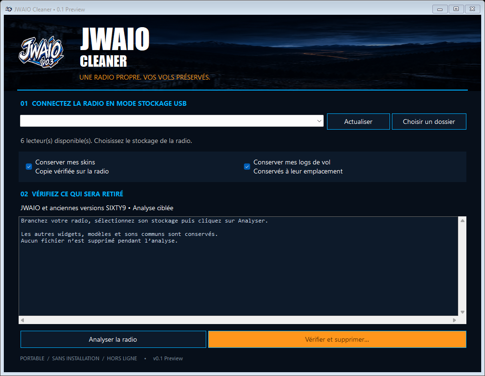

# JWAIO Cleaner — Windows 10 / 11

Version 0.1 Preview, Windows 10/11 uniquement. Linux est reporté.

**Avant téléchargement : VirusTotal signale 5/69 détections, Jotti 0/13.** Consultez les [rapports complets et l'empreinte du fichier](CLEANER-ANTIVIRUS.md). Les alertes restent à examiner ; aucune garantie d'innocuité n'est revendiquée.

**Distribution : Preview publique autorisée le 16 septembre 2026, avec alertes antivirus non résolues.**

[Code source](../tools/JWAIO-Cleaner/) · [Retour à JWAIO](../README.md)

## Télécharger et comprendre les avertissements

**[Ouvrir la release JWAIO Cleaner v0.1.0 Preview](https://github.com/DrJeckyllMrHyde/JWAIO-EdgeTX/releases/tag/cleaner-v0.1.0-preview)**, puis déplier **Assets** et choisir **JWAIO-Cleaner.exe**. Les fichiers « Source code » servent aux développeurs : ils ne sont pas nécessaires pour utiliser Cleaner. L'EXE peut rester sur le Bureau ou une clé USB ; il n'y a rien à installer.

« Preview » signifie première version de test. Le mainteneur a testé Cleaner avec succès sur des radios physiques RadioMaster TX15 et TX16, sans problème constaté. Avant tout nettoyage, copiez le contenu du stockage de votre radio dans un dossier de sauvegarde sur votre ordinateur.

### Mon antivirus affiche une alerte : que signifie-t-elle ?

Une alerte est un signal à examiner. Un « faux positif » désigne un logiciel légitime classé à tort comme dangereux. **C'est une possibilité ici, pas une conclusion confirmée.** Les dernières analyses documentées du 15 septembre 2026 donnent **5/69 chez VirusTotal** et **0/13 chez Jotti**. Ces services consultent plusieurs moteurs ; leurs résultats peuvent différer et évoluer.

Les cinq alertes sont : Arctic Wolf `Unsafe`, Elastic `Malicious (high Confidence)`, Malwarebytes `MachineLearning/Anomalous.96%`, MaxSecure `Trojan.Malware.300983.susgen` et SecureAge `Malicious`. Le « 96 % » de Malwarebytes mesure une anomalie par rapport à son apprentissage ; ce n'est pas une probabilité de 96 % que Cleaner soit un virus.

L'examen a relié l'indicateur « obfuscation/Base64 » au contrôle des empreintes des fichiers. Cela n'explique pas les cinq verdicts antivirus. Un événement concernant le processus Windows LSASS reste d'origine incertaine. Aucun éditeur n'a confirmé de faux positif et aucune certification d'innocuité n'est revendiquée.

**L'EXE n'est pas signé numériquement.** Windows peut donc afficher un éditeur inconnu ou un avertissement de réputation SmartScreen. Ce message est distinct d'une détection de menace par l'antivirus. Les propriétés Windows affichent aussi `0.0.0.0` : la version du produit n'a pas encore été renseignée dans cette compilation.

**En cas de blocage :** fermez le lancement, gardez votre protection active et n'ajoutez pas d'exclusion. Vous pouvez utiliser la [désinstallation manuelle](INSTALLATION.md#désinstaller) ou attendre une version dont les alertes auront été clarifiées. Pour demander de l'aide, indiquez le nom de l'antivirus et le texte exact de l'alerte dans les [Issues](https://github.com/DrJeckyllMrHyde/JWAIO-EdgeTX/issues), sans joindre vos logs de vol ni vos données personnelles.

[Rapport VirusTotal](https://www.virustotal.com/gui/file/e41575b496a3298df5b76de15e7e0dd58d3c65d6170d98295e2b08f23129d8b3/detection) · [Rapport Jotti](https://virusscan.jotti.org/fr-FR/filescanjob/5gc2mp87km) · [Examen détaillé et vérification du téléchargement](CLEANER-ANTIVIRUS.md)

## Utilisation

Vous pouvez fermer l'application sans rien supprimer tant que vous n'avez pas confirmé le nettoyage.

1. Lancez **JWAIO-Cleaner.exe**, depuis le Bureau ou une clé USB.
2. Branchez la radio avec son port USB de données et choisissez **Stockage USB** sur la radio.
3. Sélectionnez le lecteur de la radio. Les lecteurs contenant `WIDGETS/JWAIO` ou `WIDGETS/SIXTY9` sont repérés automatiquement. Si nécessaire, utilisez **Actualiser** ou **Choisir un dossier** pour désigner la racine du stockage contenant WIDGETS.
4. Choisissez si vous souhaitez conserver vos **skins** et vos **logs de vol**. Les deux cases sont cochées par défaut.
5. Cliquez sur **Analyser la radio**, puis vérifiez la liste complète.
6. Cliquez sur **Vérifier et supprimer…**, puis confirmez le lecteur et vos choix. La confirmation sélectionne « Non » par défaut.
7. Attendez le bilan, retirez JWAIO / SIXTY9 des écrans des modèles concernés dans EdgeTX, puis éjectez le stockage avant de débrancher.

La suppression est définitive, sans passage par la Corbeille. Aucune suppression n’a lieu pendant l’analyse.

## Skins et logs

Les skins conservés sont copiés dans `JWAIO-Sauvegardes/<date-identifiant>/`, **sur la radio**. Leur arborescence d’origine est conservée et chaque copie est vérifiée par SHA-256 avant de supprimer les originaux. Le widget et ses sons sont ensuite retirés. Pour les anciennes versions sans dossier `skins`, le dossier `img` et le fichier `config.lua` sont sauvegardés pour préserver les éléments visuels personnalisés.

Pour réutiliser un skin, réinstallez la version souhaitée du widget, puis recopiez votre dossier de skin depuis cette sauvegarde. Ne remplacez pas tout le `config.lua` d’une nouvelle version par une ancienne configuration.

Les logs conservés restent dans `LOGS/JWAIO` et `LOGS/SIXTY9`, à leur emplacement d’origine. Les sauvegardes antérieures créées par Cleaner sont exclues des analyses suivantes.

## Périmètre du nettoyage

- Dossiers `WIDGETS/JWAIO` et `WIDGETS/SIXTY9`, y compris les fichiers compilés présents dans ces dossiers.
- Copies renommées commençant par `JWAIO-`, `JWAIO_`, `JWAIO.` ou `JWAIO ` (et équivalents SIXTY9), seulement si `main.lua` contient le chemin interne du widget connu.
- Dossiers de sons propres au widget sous `SOUNDS/<langue>/JWAIO` et `SOUNDS/<langue>/SIXTY9`.
- Dossiers de logs propres au widget, uniquement si la conservation est décochée.
- Notices `JWAIO_README.txt` et `SIXTY9_README.txt` à la racine concernée.
- Paquets décompressés à un niveau sous la racine, dont le nom appartient à la famille JWAIO / SIXTY9 et qui contiennent WIDGETS.

Les modèles EdgeTX, les autres widgets, les sons communs et les logs généraux restent intacts. Les réglages des écrans dans les modèles ne sont pas modifiés : retirer l’instance du widget se fait depuis la radio. Les archives ZIP, dossiers arbitrairement renommés, chemins personnalisés hors de ce périmètre et copies plus profondément imbriquées ne sont pas recherchés. Les fichiers partagés comme les licences générales ne sont pas supprimés.

## Portabilité

Un seul EXE contient l’application, le logo et le fond. Aucun installateur, service, téléchargement, paramètre persistant, cache applicatif, journal local ni accès au registre n’est programmé. Aucun droit administrateur n’est demandé. L’application utilise le .NET Framework fourni avec Windows 10/11 ; aucune dépendance ne doit être ajoutée sur un Windows standard.

Les seules écritures normales sont les sauvegardes demandées et les suppressions confirmées sur le stockage sélectionné. L’application ne s’extrait pas dans un dossier temporaire. Les éventuelles traces gérées par Windows lui-même ne sont pas sous le contrôle de Cleaner. Le code source, ce guide et l’aperçu ne sont pas nécessaires pour lancer l’EXE.

## Vérifications et limites

45 assertions automatisées ont passé : quatre combinaisons de conservation, préservation des autres données, sauvegarde vérifiée, détection de changements avant suppression, fichier en lecture seule, copies anciennes et refus d’une jonction vers un autre dossier.

11 copies d’archives réelles ont également été nettoyées avec vérification des sauvegardes : SIXTY9 0.1.0 à 0.1.6, JWAIO 0.3.0 alpha et les trois variantes JWAIO 0.3.1 (TX15, TX16 Mk1/Mk2, TX16 Mk3). Interface compilée, démarrée et contrôlée visuellement sur cette machine Windows.

Cette Preview a été testée avec succès sur des radios physiques RadioMaster TX15 et TX16, sans problème constaté. Elle n’a pas encore été validée sur des installations Windows 10 et Windows 11 distinctes. L’exécutable n’est pas signé numériquement. Une déconnexion, une panne de stockage ou une erreur d’accès pendant la suppression peut laisser un nettoyage partiel : le bilan l’indique ; les suppressions déjà effectuées ne sont pas annulées. Ne débranchez pas la radio pendant l’opération.

## Sources

Le dossier [tools/JWAIO-Cleaner](../tools/JWAIO-Cleaner/) contient le code, les tests et les ressources graphiques d’origine. `build-windows.ps1` compile l’EXE avec le compilateur du .NET Framework Windows. Les visuels proviennent des créations JWAIO existantes et relèvent de la licence des ressources du dépôt.
