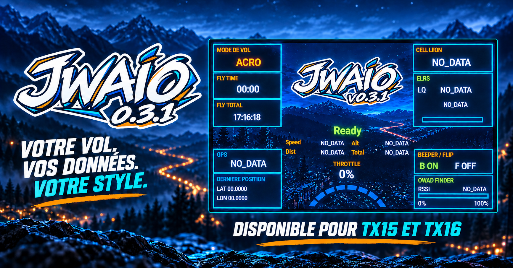

# Galerie de skins JWAIO

JWAIO est installé avec son skin de base. Cette galerie vous permet de découvrir d'autres styles et de télécharger uniquement celui que vous souhaitez utiliser. Votre radio reste ainsi propre, sans collection de skins inutilisés.

Pour chaque skin, je propose un aperçu et un tableau de téléchargement par radio. Choisissez toujours la ligne qui correspond exactement à votre modèle.

## Skin JWAIO — base

  

Le skin JWAIO est fourni avec le widget. Les paquets ci-dessous permettent de le restaurer ou de l'utiliser comme base pour créer un nouveau skin. Le fond, le logo et les couleurs sont identiques sur les trois radios ; les réglages LED sont adaptés à chaque modèle.

| Radio | Réglage LED fourni | Télécharger |
|---|---|---|
| TX15 / TX15 Max | Activé par défaut | [Skin JWAIO pour TX15](jwaio/JWAIO-Skin-JWAIO-TX15.zip?raw=true) |
| TX16S Mk1 / Mk2 | Désactivé par défaut | [Skin JWAIO pour TX16S Mk1/Mk2](jwaio/JWAIO-Skin-JWAIO-TX16S-Mk1-Mk2.zip?raw=true) |
| TX16S Mk3 | Désactivé par défaut ; essai physique recherché | [Skin JWAIO pour TX16S Mk3](jwaio/JWAIO-Skin-JWAIO-TX16S-Mk3.zip?raw=true) |

[Vérifier les empreintes SHA-256](jwaio/SHA256SUMS.txt)

### Installation

1. Sauvegardez le stockage de votre radio.
2. Téléchargez le ZIP correspondant à votre modèle, puis décompressez-le.
3. Copiez le dossier `jwaio` obtenu dans `/WIDGETS/JWAIO/skins/`.
4. Acceptez le remplacement uniquement si vous souhaitez restaurer le skin de base déjà présent.
5. Éjectez proprement la radio et redémarrez-la.

Pour installer un futur skin sans remplacer le skin de base, son ZIP contiendra un dossier portant un autre nom. Il suffira de le copier à côté du dossier `jwaio`, puis de le sélectionner dans l'option **Skin** du widget.

Vous souhaitez créer votre propre style ? Consultez le [guide de création et de personnalisation](../docs/SKINS.md).

## Modèle pour les prochains skins

Chaque nouveau skin ajouté à cette galerie reprendra la même présentation : un aperçu, une courte description et un tableau proposant le bon paquet pour chaque radio compatible. Vous pourrez ainsi comparer les styles avant de télécharger quoi que ce soit.